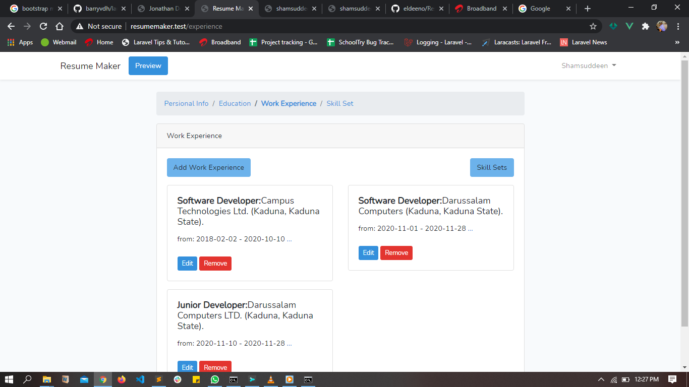
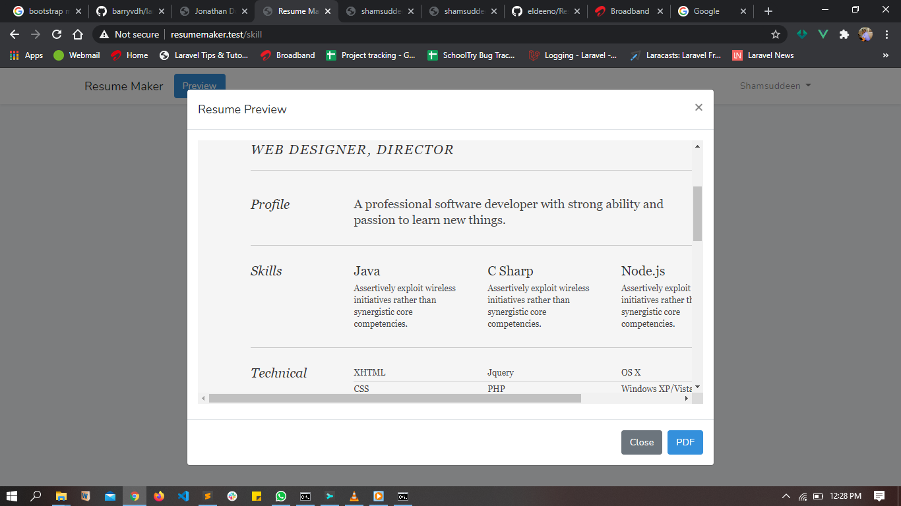

## ResumeMaker
This is a simple resume builder application which i will subsequently be adding cool functionalities and features to. it is developed using Laravel 7.

#### Screen Shots

## How to install
1. Clone the ResumeMaker repo
2. run `<addr>` composer require barryvdh/laravel-dompdf

you're good to go
cheers!